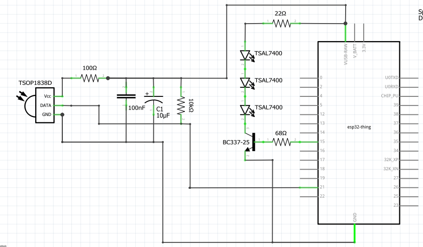
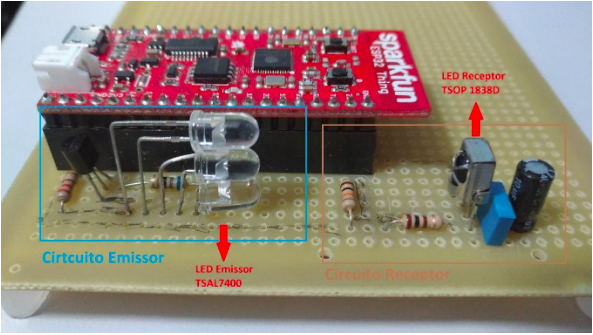

# Air conditioning control: using IoT to save energy.
## Computer engineering bachelor's thesis at Campinas State University

The project aims to create a system capable of controlling air conditioning devices using IoT to save energy. Using an ESP32 microcontroller and infrared LEDs (sensor and actuator) to receive commands from air conditioning remote controls, store them and when necessary control the air conditioner (remotely through internet) or automatically (using other sensors).

For the hardware it was used the SparkFun's ESP32 Thing microcontroller with the Espressif IoT Development Framework v3.1.2.

The software is divided in 3 parts: 
* Submodule [ir_tx_rx](https://github.com/andreyuki/ir_tx_rx) is used.
* A python script (controle.py) that send and receives information through serial communication with ESP32. It is pretty basics:
  * Record mode:record the commands from the remote control 
  * Send mode: in which you select the command and ESP32 sends it to the air conditioner.
* Main program that integrates:
  * The submodule ir_tx_rx to receive and send commands to the air conditioner; 
  * An UART that receives commands through serial from python; 
  * A non-volatile storage, that storages the commands without losing them if the power goes off.

## Schematics

For receiving the infrared signal the following are used: an infrared sensor led (TSOP1838D), a 10uF and a 100nF capacitor, a 100 Ohm resistor and a 10k Ohm.

For sending the infrared signal the following are used: 3 infrared emitter led (TSAL7300), one NPN transistor (BC337-25), one 22 Ohm resistor and one 68 Ohm

The capacitors and resistors are used to decrease the noise on the sensor and the transistor is to increase the current in the emitters.

The sensor is using port 21 and emitter port 15.

